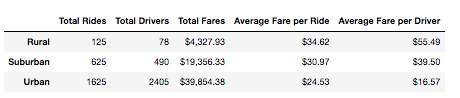
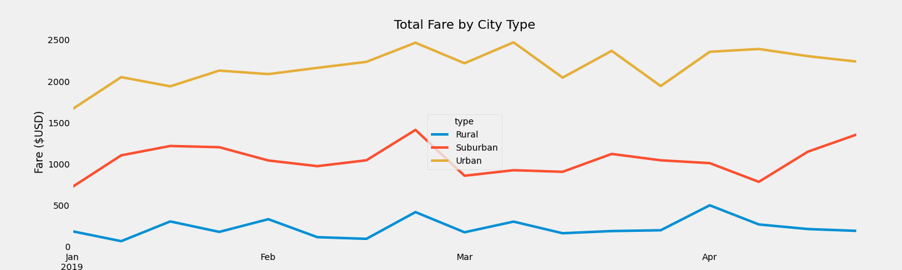

# PyBer Analysis

## Overview
I was tasked with creating a summary DataFrame of the ride-sharing data by city type for Pyber, a ride-share company using Jupiter Notebook and Python. After the DataFrame was created,I had to use matplotlib to create a line chart to showcase the fares by city type across the months the data was collected. 

## Results
Using the ride-sharing data for the months of January through April, we looked at the
differences for the different city types. The city types we looked at are rural, suburban, and urban. Below is the summary DataFrame I created with this information.

* Total Rides: the urban city type has 13 times more rides compared to the rural city type, and 2.6 times more rides than the suburban city type. 
* Total Drivers: urban city type has 30 times more drivers than the rural city type, and 5 times more drivers than the suburban city type. 
* Total Fares: The total urban fares were 9 times higher than rural and 2 times higher than the suburban city type. 
* Average Fare per Ride: The difference in average fare per ride is not as big for the rural, suburban, and urban city types. The rural has the highest average fare per ride. The urban has the lowest fare per ride. 
* Average Fare per Driver: The average fare per driver is close to 4 times higher in the rural versus the urban city type. 

## Summary
Based on the data analysis, below are there business recommendations for Pyber:

1. Decreasing the pool of drivers for the urban city type, and determine a maximum cap. Give priority to drivers that are consistently providing rides. This would driver average fare per driver up, and increase driver compensation and loyalty.

2. Encourage urban drivers to work on suburban environments when demand (fares) is lower in the urban city type. For example, in the multiple line graph we can observe a drop in weekly fares in March for the urban city type, yet fares stay consistent in suburban areas. This would help increase the average fare per driver.

3. Decrease prices in rural and suburban areas for a limited time to encourage adoption of the service. 